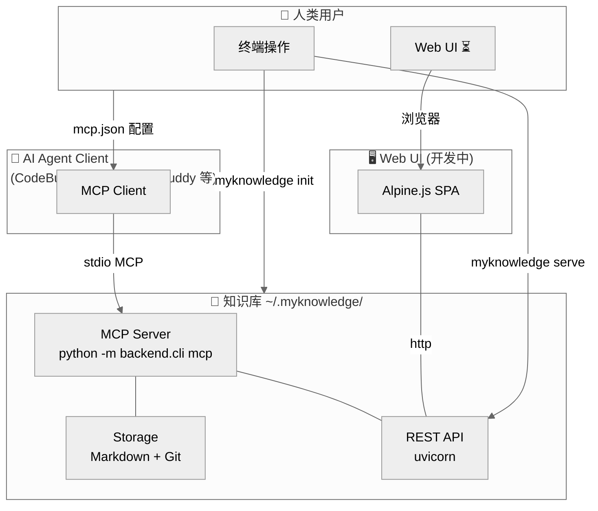
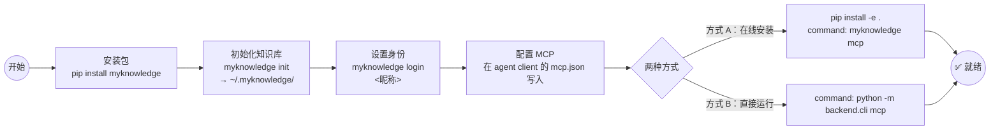
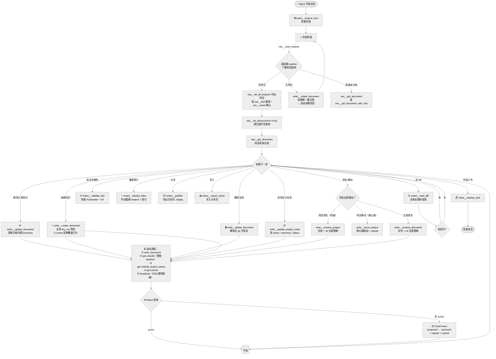
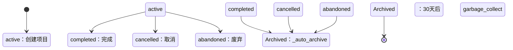

# MyKnowledge — 产品工作流

> 本文档描述从人类安装到 AI Agent 完成知识管理的完整工作流。
> 流程图使用 Mermaid 绘制，GitHub / Obsidian / Typora 等工具可原生渲染。

---

## 一、系统全景



---

## 二、安装与初始化



### 2.1 安装

```bash
git clone https://github.com/CoderMoray/MyKnowledgePlatform
cd MyKnowledgePlatform
pip install -e .
```

### 2.2 初始化知识库

```bash
myknowledge init                      # 创建 ~/.myknowledge/
myknowledge login your@email.com 昵称  # 设置身份（写操作必需）
```

### 2.3 配置 Agent Client MCP

在 agent client（如 CodeBuddy）的 MCP 配置文件中添加：

```json
{
  "mcpServers": {
    "myknowledge": {
      "type": "stdio",
      "command": "myknowledge",
      "args": ["mcp"],
      "description": "MyKnowledge 知识管理平台"
    }
  }
}
```

---

## 三、Agent Client 工作流（核心）

这是 AI Agent 与知识库交互的完整流程。
MCP 先抛去锁才能读 diff；写完释放锁。



### 3.1 工作流要点

| 步骤 | 工具 | 说明 |
|------|------|------|
| **🔒 加锁** | `maint__acquire_lock` | 必须先加锁才能写。无锁时写操作报错，引导 AI 执行维护流程 |
| **📖 导航** | `nav__read_readme` / `nav__list_dir`（支持 `recursive`）/ `nav__exists` / `nav__find` | 先确认路径再操作，避免盲目翻目录 |
| **✏️ 写操作** | `write__create_document`（`dry_run` 预览 / `if_exists` 策略）/ `write__update_document` / `write__update_project_meta` / `write__delete_document` | 路径必须符合白名单（`common-knowledge/` / `projects/` / `archive/`） |
| **✏️ 改名/移动** | `write__rename_project` / `write__move_project` / `write__rename_document` | 改名同级，移动换父级，自动替换 ref |
| **🔁 自动流程** | _write_through | 写完自动触发 rebuild + git commit + SSE broadcast |
| **📦 归档** | 自动 | status 为非 active 时自动移入 archive/ |
| **🔍 维护** | `maint__read_diff` / `maint__validate_doc` / `maint__rebuild_index` / `maint__check_integrity` | 检查变更、完整性和 GC 清理 |
| **🔓 解锁** | `maint__release_lock` | AI 完成工作后释放锁 |

---

## 四、路径规则（AI 必读）

所有写工具不接受以下路径：

| 禁止 | 原因 |
|------|------|
| `..` | 路径穿越 |
| `/` 开头 | 绝对路径 |
| 非 `.md` 结尾（文件） | 只支持 Markdown |
| `projects` / `archive` | 系统目录 |
| 不存在的项目目录 | 先用 `nav__list_dir` 列出 |

正确示例：

```
common-knowledge/术语表.md                              → 根层知识
projects/首页重构/common-knowledge/改版方案.md            → 项目内知识
projects/MyKnowledge 项目知识管理平台/projects/前端设计与开发 → 子项目
archive/首页重构                                    → 归档项目目录
```

路径格式错误时，MCP 工具会返回带恢复指引的报错：

```
路径错误：projects

「projects」是系统目录，不是项目。

恢复方法：
  1. 调 nav__list_dir(project_rel="projects") 列出所有活跃项目
  2. 用列出的项目名构造正确路径重试
```

---

## 五、状态与归档



| 状态 | 位置 | 前台显示 |
|------|------|----------|
| `active` | `projects/` | 🟢 进行中 |
| `completed` | `archive/` | ✅ 已完成 |
| `cancelled` | `archive/` | ⏹ 已取消 |
| `abandoned` | `archive/` | ❌ 已废弃 |

---

## 六、版本

```json
// GET /api/version
{
  "system": "0.5.0",   // 后端 __version__.py
  "kb": "c10b1c4"       // AI checkpoint 对应的 commit hash
}
```

- `system`：系统版本，手动维护
- `kb`：知识库版本，来自 `agent-commit.txt`（AI 处理完变更后写入）。首次使用时空，显示"当前未创建任何知识"

---

## 七、异常处理

### 锁被占用

```text
错误：写锁不存在 → 调 maint__acquire_lock
错误：LOCK BUSY    → 其他 AI 正在操作，稍后重试
```

### 路径错误

```text
路径不存在 → 调 nav__list_dir 列出现有项目
路径格式错误 → 参考第四节正确格式
路径穿越禁止 → 使用 KB 相对路径
```

### 写操作失败

```text
文档已存在 → 用 write__update_document 替代 write__create_document
无写锁     → 先调 maint__acquire_lock
git 冲突   → 调 maint__read_diff 查看差异，确认后重试
```
